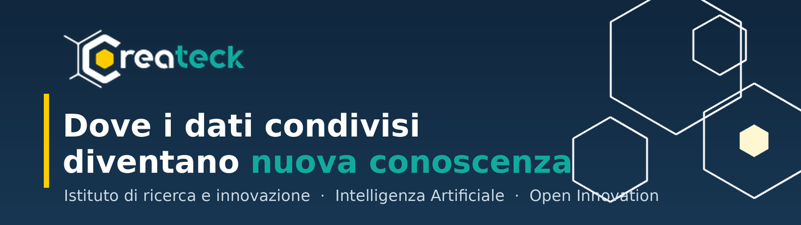
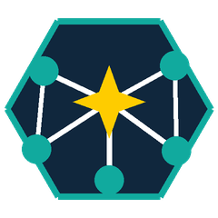
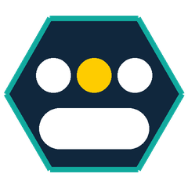
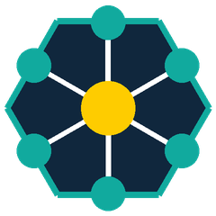
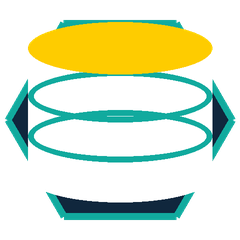
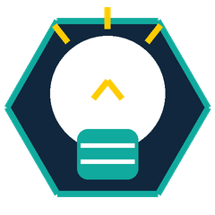
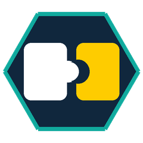

# CREATECK Centre for Research, Engineering and Advanced Technologies for Collaborative Knowledge

  

  
  
  
  

<h3 align="center">Createck è un Istituto di Ricerca e Innovazione in ambito tecnologico e umanistico.</h3>

  <em>Esploriamo come le persone possano collaborare, in forma organizzata e aperta, 
  per raccogliere sfide di creazione di nuova conoscenza in base all’analisi di dati.</em>

---

##  Concepiamo l'innovazione come frutto di una rete

Collaboriamo con **università** e **imprese**, con specialisti di diversi ambiti applicativi, per sviluppare applicazioni innovatore basate sul paradigma dell'Intelligenza Artificiale.

Molte realtà di eccellenza sviluppano modelli e applicazioni di AI.
**Noi partiamo un passo prima** — esattamente dove la maggior parte dei progetti di
AI riesce o silenziosamente fallisce: la **raccolta di dati organizzata e finalizzata.**

Farla bene significa rispondere alle domande difficili:

|  |  |
| 🔍 **Significatività** | I dati sono davvero rilevanti rispetto alla finalità? |
| 📐 **Dimensionamento** | Quanti dati, di che tipo, raccolti come? |
| 👥 **Community** | Come si coinvolge e si forma una community di contributori? |
| ⚖️ **Sostenibilità etica** | Privacy, consenso, finalità d'uso sono garantiti? |
| 🛠️ **Strumenti** | Quali mezzi servono — spesso da ideare appositamente? |

Rispondere bene a queste domande è ciò che distingue un progetto di AI che funziona da uno che non decolla mai del tutto.

---

##  Comitato Tecnico Scientifico

**Createck** è un **Organismo di Ricerca**, cioè un soggetto senza scopo di lucro, dedito ad attività di produzione e diffusione di nuova conoscenza. 
Le tecnologie abilitanti sono quelle dell’informatica e dell’analisi dati.

##  Siamo per un'AI comunitaria e democratica

•  Implementiamo pipeline di lavoro distribuito in ambieto AI per vari profili di specializzazione, utilizzando **strumenti aperti**, semplici, trasparenti.

•  Promuoviamo un uso responsabile dei dati e delle applicazioni in ambito AI adottando i **principi FAIR** e prediligendo l'**explainability**.

---

##  Rendiamo possibile la raccolta sistematica dei dati

Ci occupiamo della **raccolta dei dati** per i progetti di ricerca e innovazione, sensorizzando l'ambiente e/o coinvolgendo community nella raccolta.

---

##  Rendiamo tecnologie complesse soluzioni alla portata di tutti

•  Forniamo **consulenza tecnica** in ambito statistico e AI per i tuoi progetti innovativi

•  Adattiamo gli **strumenti di analisi** più potenti alla misura dei problemi delle persone e delle imprese.

##  Costruiamo qualcosa insieme

Che tu sia un'**azienda** con una sfida sui dati, un **gruppo di ricerca** in cerca di
nuovi strumenti, o un **partner** interessato all'AI collaborativa — ci farebbe
piacere parlarne.

  
  

---

  
    Artificial Intelligence · Open Innovation · Collaborative Knowledge ·
    Inbound Open Innovation · Outbound Open Innovation · Open Innovation Platform
  

